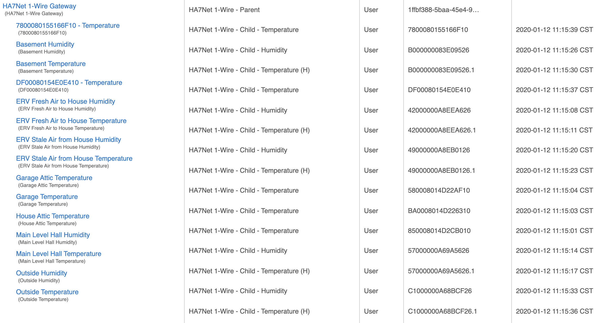
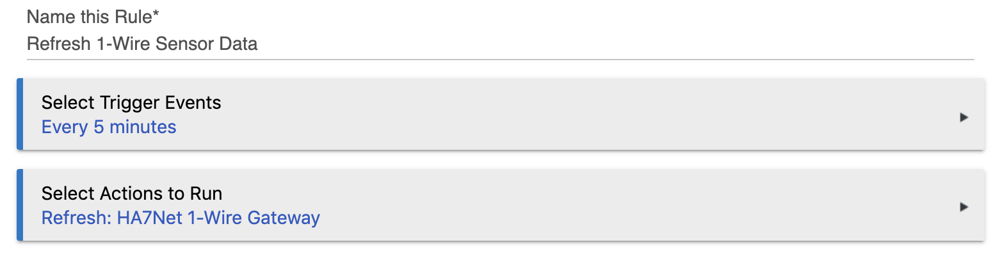
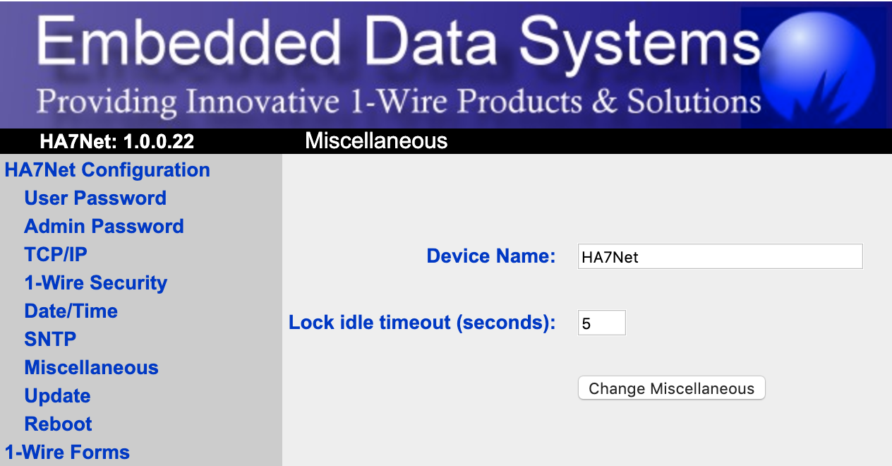

# Hubitat Drivers for HA7Net and 1-Wire Devices

This set of [Hubitat Elevation](https://hubitat.com/) device drivers enable you to integrate an [HA7Net](https://www.embeddeddatasystems.com/HA7Net--Ethernet-1-Wire-Host-Adapter_p_22.html) appliance with Hubitat.  It consists of a parent driver that manages the overall interaction with an HA7Net and set of child drivers to represent different types of 1-Wire sensors supported by the HA7Net.

## About the HA7Net
An HA7Net provides a simple interactive web interface over an ethernet interface to interact with a set of 1-Wire sensors attached to the 1-Wire network ports. In order for sensor data to be made available in Hubitat, we use a set of device drivers to issue POST requests to the HA7Net to obtain sensor data. Typically, you would set up a Hubitat Rule Machine (RM) rule to periodically poll all of your 1-Wire sensors via the HA7Net.

Although firmware updates for the HA7Net are no longer available, the device supports a decent number of 1-Wire sensors (100), is pretty simple to use, and, in my experience, has been very stable over may years of use.  Since 1-Wire sensors are typically inexpensive, people who already have the HA7Net might want to keep using it as a gateway between their 1-Wire sensors and modern home automation platforms such as Hubitat.

## Support for Similar Devices

It should not be difficult to extend these drivers to support similar 1-Wire gateway appliances such as the [OW-Server](https://www.embeddeddatasystems.com/OW-SERVER-1-Wire-to-Ethernet-Server-Revision-2_p_152.html). This device supports just 22 sensors, but appears to offer a richer API as compared to the screen scrapping approach that is required to integrate with the HA7Net.

Similarly, use of [owserver](https://manpages.debian.org/testing/owserver/owserver.1.en.html) should also be failrly straightforward for those people who have deployed `owserver` on their own computers.

See [CONTRIBUTING.md](CONTRIBUTING.md) if you'd like to contribute fixes and/or enhancements.

## Current State

Beta quality. Basic testing of these drivers has been done. See the associated [issues in GitHub](https://github.com/ckamps/hubitat-drivers-ha7net/issues) for outstanding enhancements of interest.

## Supported 1-Wire Sensors

Although the HA7Net supports a broader set of 1-Wire sensors, these drivers have been tested with and currently support only these sensors:

|Sensor|Type|Notes|
|------|----|-----|
|DS18B20|Temperature||
|DS18S20|Temperature||
|DS2438|Temperature||
|AAG TAI-8540|Humidity + temperature|Uses a DS2438 sensor to provide temperature and act as the interface to the 1-Wire network and an HIH-3610-A sensor to provide humidity.|

## Usage

### 1. Deploy Drivers to Hubitat

For now, even if you don't have humidity sensors, deploy all of the following drivers to your Hubitat.

|Driver File|Description|
|-----------|-----------|
|`ha7net-parent.groovy`|Install regardless of the 1-Wire sensors you have in use. Auto discovers 1-Wire sensors via HA7Net and creates child devices.|
|`ha7net-child-temperature.groovy`|Install when you have DS18S20, DS18B20, and/or DS2438 temperature sensors.|
|`ha7net-child-humidity.groovy`|Install when you have the AAG TAI-8540 humidity + temperature sensor.|
|`ha7net-child-temperature-h.groovy`|Install when you have the AAG TAI-8540 humidity + temperature sensor.|

### 2. Create Virtual Device for the HA7Net

1. Select the driver "HA7Net 1-Wire - Parent".
1. Set the HA7Net IP address.
1. Press the "Refresh" button on the virtual device to discover the current set of 1-Wire sensors known to the HA7Net and to create child devices for each sensor.
1. Optionally, in each child device change the Device Name and/or Device Label to represent the function and/or location of the associated sensor.

The following example shows the results of the parent driver having performed a discovery of supported 1-Wire sensors, creation of child devices, and the user's modification of most of the child device names to reflect the function of each child.  Several of the child device names have not yet been customized. 

### 3. Configure Auto Refresh of Child Device Readings

Since the HA7Net is not actively sending sensor data to Hubitat, you'll typically want to set up a rule in Rule Machine (RM) to periodically trigger a refresh of the sensors by selecting an every n minutes (or whatever) trigger and an action of "refresh" on the parent device. Doing so will result in the `refreshChildren` command being sent to the parent.

### 4. Adjust HA7Net Lock Idle Timeout

Once you configure a rule to automatically refresh your child devices, you may encounter sporadic warnings in the Hubitat logs stating that `httpPost()` attempts have time out.  If you encounter these warnings, then you can adjust the HA7Net's "lock idle timout" setting from the default of 60 seconds to a much lower number such as 5 seconds.

You can modify this setting via the HA7Net web UI under "Miscellaneous":

### 5. Perform Ongoing Maintenance of Your Devices

You can manage child devices without impacting the parent and other child devices by:
* Changing the name and/or label of a child device.
* Enabling/disabling logging on a child device.
* Refreshing a child device to get the latest sensor readings.
* Deleting a child device if you either remove the associated sensor or want to have the parent recreate the child device. In the latter case, you can execute the `createChildren` command on the parent to recreate child devices for all sensors for which a child device does not already exist.

## References

### Parent Driver Commands

Within a virtual device associated with the parent driver, you can execute the following commands:

|Command|Description|
|-------|-----------|
|`createChildren`|Discover all sensors known to the HA7Net and create child devices as appropriate.  Loads current sensor reading into each child device.|
|`deleteChildren`|Delete all children.|
|`deleteUnmatchedChildren`|Not yet implemented, but its intent will be to delete child devices that are not known to the HA7Net.|
|`recreateChildren`|Deletes all children and create new children based on newly discovered sensors.|
|`refresh`|See `refreshChildren`.|
|`refreshChildren`|Updates the sensor reading for each child device by calling the `refresh()` method of each child.|

### HA7Net User's Manual and Programmer's Guide

[HA7Net User's Manual and Programmer's Guide](https://www.embeddeddatasystems.com/assets/images/supportFiles/manuals/UsersMan-HA7Net.pdf)